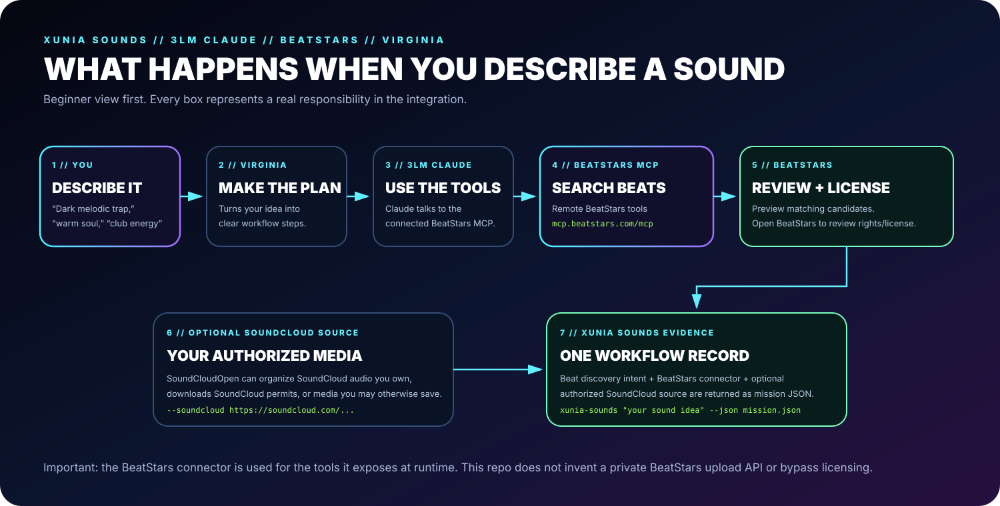

# XUNIA SOUNDS // 3LM CLAUDE // BEATSTARS // VIRGINIA



## Beginner version

XUNIA SOUNDS gives the SoundCloudOpen project a second lane:

**You describe the sound → VIRGINIA makes the plan → Claude uses the BeatStars MCP connector → you review matching beats → you handle licensing on BeatStars → SoundCloudOpen can optionally organize SoundCloud media you are allowed to save → XUNIA SOUNDS records the workflow as JSON.**

It is intentionally split this way so each platform does the job it actually supports.

## What was added

The package now installs two extra commands:

```bash
xunia-sounds
xuniasounds
```

They both run the same XUNIA SOUNDS mission builder.

### 1. Connect BeatStars to Claude

```bash
xunia-sounds --claude-setup
```

The command prints the beginner setup using the BeatStars remote MCP endpoint:

```text
https://mcp.beatstars.com/mcp
```

Claude performs the connector authentication/permission flow. SoundCloudOpen does not collect or store the BeatStars password.

### 2. Describe the beat you want

```bash
xunia-sounds "dark melodic trap with cold synths around 90 BPM"
```

That returns a VIRGINIA-style mission describing the BeatStars discovery request and the expected workflow.

### 3. Add an authorized SoundCloud source when useful

```bash
xunia-sounds \
  "find beats with a similar dark melodic atmosphere" \
  --soundcloud "https://soundcloud.com/example/sets/my-owned-catalog" \
  --format wav \
  --json xunia-mission.json
```

The SoundCloud URL is validated using SoundCloudOpen's existing URL validation. It is included as an `authorized-media-source` in the mission.

## Mission shape

The generated JSON separates the systems clearly:

```text
mode
├── VIRGINIA intent + workflow steps
├── 3LM CLAUDE orchestration role
├── BeatStars remote MCP endpoint + discovery intent
├── optional authorized SoundCloud source
└── guardrails / evidence
```

The BeatStars tools themselves are discovered by Claude from the BeatStars MCP server at connection time. This repo does not hard-code undocumented BeatStars private API calls.

## Why the BeatStars side is discovery-first

The public BeatStars Claude flow is a conversational beat-discovery experience. The integration therefore treats BeatStars MCP as a remote tool provider and leaves the exact server tool surface to BeatStars.

For buying/licensing, XUNIA SOUNDS hands the user back to the selected BeatStars page so the license can be reviewed and obtained there.

This project does **not** claim BeatStars MCP is an upload API. BeatStars' public creator workflow still documents uploads through BeatStars Studio, so XUNIA SOUNDS does not invent unsupported publishing endpoints.

## SoundCloud side

The original SoundCloudOpen downloader remains intact. Use it only for:

- audio you own;
- downloads SoundCloud permits; or
- material you otherwise have permission to save.

XUNIA SOUNDS does not change or bypass SoundCloud permissions.

## Development

Run the full test suite:

```bash
python3 -m pip install -e . pytest
pytest -q
```

The XUNIA SOUNDS tests verify:

- the exact BeatStars MCP URL;
- the 3LM CLAUDE + VIRGINIA mission structure;
- optional SoundCloud URL validation;
- JSON mission export; and
- rejection of non-SoundCloud URLs in the SoundCloud source field.
